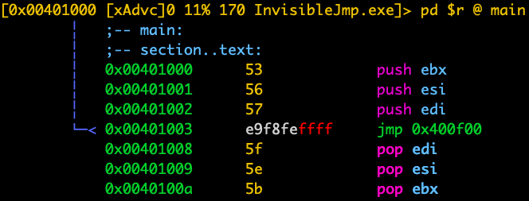
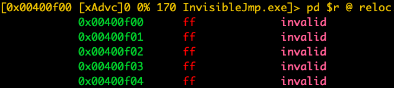

# Example

_NOTE: Source code to build binaries used in this example directory is available at [this repository](https://github.com/FFRI/BinsForXtaTools)._

_NOTE: If you want to reproduce the result on your environment, you need to get XTA cache files by running x86 executables on your environment. If you cannot reproduce the result, please raise some GitHub issues._

## `inject_c2c.py`

This script injects code in an XTA cache file (`INJECTCODETEMPLATE.EXE.*.*.mp.1.jc`) into an XTA cache file of a target application (`test_x86.exe`).
In this example, shellcode that pops up message box is injected.
You can inject your own shellcode by modifying InjectCodeTemplate of [this repository](https://github.com/FFRI/BinsForXtaTools) and getting an XTA cache file by running this application.

```
$ cd XtaTools
$ python -m example.inject_c2c ./example/inject_c2c_data/INJECTCODETEMPLATE.EXE.A401F5651230C64450FE6E187BD014C0.6BF6A824D8E01D39DD17A63D9204D9CB.mp.1.jc ./example/inject_c2c_data/InjectCodeTemplate.exe ./example/inject_c2c_data/TEST_X86.EXE.5B20F5225D2D28A89CBE553E4A97E5B7.EA101948E097853A1DBD8DCD3F23D197.mp.1.jc ./example/inject_c2c_data/test_x86.exe
# Put TEST_X86.EXE.5B20F5225D2D28A89CBE553E4A97E5B7.EA101948E097853A1DBD8DCD3F23D197.mp.1.jc on %SystemRoot%\XtaCache and run test_x86.exe
```

## `inject_a2c.py`

This script injects API hooking code into an XTA cache file of a target API.

```
$ cd XtaTools
$ python -m example.inject_a2c ./example/inject_a2c_data/shellcode/change_args.out MessageBoxA ./example/inject_a2c_data/USER32.DLL.B762FE91071D23DA8720F34E3667A5AB.31468294266C99D8935B35F6F76A0DF7.mp.1.jc ./example/inject_a2c_data/user32.dll
# Put USER32.DLL.B762FE91071D23DA8720F34E3667A5AB.31468294266C99D8935B35F6F76A0DF7.mp.1.jc on %SystemRoot%\XtaCache and run application pops up a message box window
```

(**ATTENTION** We do not redistribute user32.dll. If you want to reproduce the result, you need to get %SystemRoot%SysChpe32\user32.dll and the corresponding XTA cache file on your own environment.)

Although instructions at the beginning of the target API is not modified from x86 layer, the argument of MessageBoxA is modified by putting the XTA cache file created by this script.


## `inject_s2c.py`

This script makes an XTA cache file to demonstrate "invisible jmp."
It injects shellcode.out into an XTA cache file of InvisibleJmp.exe.

```
$ cd XtaTools
$ python -m example.inject_s2c ./example/inject_s2c_data/shellcode/shellcode.out ./example/inject_s2c_data/INVISIBLEJMP.EXE.ACB479C0F066D29E0704F7B1C44EE4BB.F394A17EF5329D8EFDF79CFFABFBABBD.mp.1.jc ./example/inject_s2c_data/InvisibleJmp.exe
# Put INVISIBLEJMP.EXE.ACB479C0F066D29E0704F7B1C44EE4BB.F394A17EF5329D8EFDF79CFFABFBABBD.mp.1.jc on %SystemRoot%\XtaCache and run InvisibleJmp.exe
```

**What is invisible jmp? How it works?**

From x86 layer, there is an invalid jmp code in InvisibleJmp.exe as follows. We will expect segfault by running this x86 app.





However, surprisingly, we can run this x86 application without crash by putting the cache file created by this script on %SystemRoot%\XtaCache.


Why? This is because this script injects new address pair whose x86 rva is 0xf00 and its corresponding shellcode into the XTA cache file.
When "jmp InvisibleJmp+0xf00" is executed, injected shellcode (`shellcode.out`) is executed.

## `inject_x2c.py`

This script injects x86 shellcode into an XTA cache file of a target application.
x86 shellcode is executed by calling CreateThread function.

```
$ cd XtaTools
$ python -m example.inject_x2c ./example/inject_x2c_data/RunFromMemoryX86.exe ./example/inject_x2c_data/w32-exec-calc-shellcode.bin ./example/inject_x2c_data/TEST_X86.EXE.5B20F5225D2D28A89CBE553E4A97E5B7.EA101948E097853A1DBD8DCD3F23D197.mp.1.jc ./example/inject_x2c_data/test_x86.exe
# Put TEST_X86.EXE.5B20F5225D2D28A89CBE553E4A97E5B7.EA101948E097853A1DBD8DCD3F23D197.mp.1.jc on %SystemRoot%\XtaCache and run test_x86.exe
```

## `inject_e2c.py`

This script injects a PE Loader and an ARM64 executable into an XTA cache file of a target application.
Note that some native APIs are not callable in an ARM64 executable as described in the presentation material.

```
$ cd XtaTools
$ python -m example.inject_e2c ./example/inject_e2c_data/RunFromMemoryARM64.exe ./example/inject_e2c_data/test_arm.exe ./example/inject_e2c_data/TEST_X86.EXE.5B20F5225D2D28A89CBE553E4A97E5B7.EA101948E097853A1DBD8DCD3F23D197.mp.1.jc ./example/inject_e2c_data/test_x86.exe
# Put TEST_X86.EXE.5B20F5225D2D28A89CBE553E4A97E5B7.EA101948E097853A1DBD8DCD3F23D197.mp.1.jc on %SystemRoot%\XtaCache and run test_x86.exe
```

## `show_coverage.py`

This script shows a function coverage of a target x86 executable.

```
$ cd XtaTools
$ python -m example.show_coverage show-function-coverage python -m example.show_coverage show-function-coverage ./example/show_coverage_data/BRANCH.EXE.B4DA06B11F6FC8D0BA6DB6429826FF51.4F509D1C25724F05EF5BDE17331477F4.mp.1.jc ./example/show_coverage_data/Branch.exe cov.log
```
